# AI Builders Digest — Project Description

A fully automated, end-to-end pipeline that turns the daily noise of the AI industry
into a curated, bilingual (DE/EN) digital magazine.

---

## 1. Business Logic (verified against the codebase)

| Stage | What actually happens |
|---|---|
| **Trigger** | GitHub Actions cron `0 6 * * 1,3,5` → **Mon / Wed / Fri at 06:00 UTC** (08:00 Zurich). Also manually dispatchable. |
| **Data Collection** | Three parallel sources, not just X: • **X / Twitter** — 9 hand-picked AI builders, last **24h** (Nitter RSS by default; X API v2 if `X_BEARER_TOKEN` is set) • **Podcasts** — 11 feeds, last **72h** • **Blogs** — 10 sources (2 scraped + 8 RSS), last **72h** |
| **Clean & Prepare** | Deduplication via persistent state (`data/state-feed.json`), time-window filtering, merge + normalization of all sources into `data/feeds/*.json` ("Prepare AI Input"). |
| **AI Processing** | A large language model — **DeepSeek (primary)**, **Claude / Anthropic (fallback)** — classifies, distills, and rewrites the feed into **structured bilingual (DE/EN) JSON** (title, sections, cards, priority, tags). |
| **Store & Render** | The model output is validated and saved as the issue's source-of-truth JSON (`data/issues/*.json`). **Git is the datastore** — there is no traditional database. The issue is rendered to static HTML, the Archive is auto-updated, and a **Telegram** notification is pushed. |
| **Publish & Display** | The static "digital magazine" (cover + themed sections + browsable back issues) is deployed automatically to **Vercel** (auto-deploy on push; also on GitHub Pages). |

**In one sentence:** X + Podcasts + Blogs → dedup & normalize → LLM bilingual summary → Git storage → static magazine auto-published.

### Key facts / corrections vs. the original draft

- **Number of X builders:** currently **9** (not 6–8).
- **Sources are not X-only:** the pipeline also aggregates **11 podcasts** and **10 blogs**.
- **No traditional database:** issues are stored as JSON files, version-controlled in **Git**.
- **Lookback windows differ:** X = 24h, Podcasts & Blogs = 72h.
- **Extra output:** a **Telegram** push notification is part of each run.

---

## 2. Architecture Diagram (Mermaid)

```mermaid
flowchart LR
  %% ===== region (subgraph) tints =====
  style S1 fill:#fffbeb,stroke:#f59e0b,stroke-width:1px,color:#78350f
  style S2 fill:#eff6ff,stroke:#3b82f6,stroke-width:1px,color:#1e3a8a
  style S3 fill:#eef2ff,stroke:#6366f1,stroke-width:1px,color:#312e81
  style S4 fill:#faf5ff,stroke:#a855f7,stroke-width:1px,color:#581c87
  style S5 fill:#f0fdf4,stroke:#22c55e,stroke-width:1px,color:#14532d
  style S6 fill:#fff1f2,stroke:#f43f5e,stroke-width:1px,color:#881337

  subgraph S1["⏱ Trigger"]
    direction TB
    T1["GitHub Actions · Cron<br/>Mon · Wed · Fri — 06:00 UTC"]
  end

  subgraph S2["📡 Data Collection"]
    direction TB
    X["X / Twitter<br/>9 AI builders · last 24h<br/>Nitter RSS / X API v2"]
    P["Podcasts<br/>11 feeds · last 72h"]
    B["Blogs<br/>10 sources · last 72h"]
  end

  subgraph S3["🧹 Clean &amp; Prepare"]
    direction TB
    C1["Dedup + time-window filter<br/>persistent state"]
    C2["Merge &amp; normalize<br/>→ Prepare AI Input (feed JSON)"]
  end

  subgraph S4["🧠 AI Processing"]
    direction TB
    A1["LLM Summarize &amp; Classify<br/>DeepSeek (primary) · Claude (fallback)"]
    A2["Structured bilingual JSON<br/>title · cards · tags · EN/DE"]
  end

  subgraph S5["🗄 Store &amp; Render"]
    direction TB
    D1["Validate + save issue JSON<br/>Git as datastore"]
    D2["Render magazine HTML"]
    D3["Auto-update Archive"]
  end

  subgraph S6["🌐 Publish &amp; Display"]
    direction TB
    PUB["Deploy on Vercel<br/>auto on push"]
    TG["Telegram push"]
    MAG["Digital Magazine<br/>cover + back issues"]
  end

  T1 --> X
  T1 --> P
  T1 --> B
  X --> C1
  P --> C1
  B --> C1
  C1 --> C2 --> A1 --> A2 --> D1
  D1 --> D2 --> D3 --> PUB --> MAG
  D1 --> TG

  %% ===== node styles =====
  classDef trigger fill:#fde68a,stroke:#f59e0b,stroke-width:2px,color:#78350f;
  classDef collect fill:#bfdbfe,stroke:#3b82f6,stroke-width:2px,color:#1e3a8a;
  classDef clean   fill:#c7d2fe,stroke:#6366f1,stroke-width:2px,color:#312e81;
  classDef ai      fill:#e9d5ff,stroke:#a855f7,stroke-width:2px,color:#581c87;
  classDef store   fill:#bbf7d0,stroke:#22c55e,stroke-width:2px,color:#14532d;
  classDef publish fill:#fecdd3,stroke:#f43f5e,stroke-width:2px,color:#881337;

  class T1 trigger;
  class X,P,B collect;
  class C1,C2 clean;
  class A1,A2 ai;
  class D1,D2,D3 store;
  class PUB,TG,MAG publish;
```

> Color coding by stage: Trigger = amber, Collection = blue, Clean = indigo, AI = purple, Store = green, Publish = rose.
> If your Mermaid renderer is strict about emojis, remove `⏱📡🧹🧠🗄🌐` from the subgraph titles.

---

## 3. Project Description (~150 words)

### English

> **AI Builders Digest** is an autonomous, end-to-end pipeline that turns the daily noise of the AI industry into a curated bilingual magazine. Three times a week, a scheduled GitHub Actions workflow gathers the last 24–72 hours of activity from a hand-picked universe of voices — nine leading AI builders on X, eleven research podcasts, and ten engineering blogs. The raw stream is deduplicated, time-filtered, and normalized, then handed to a large language model (DeepSeek, with Claude as fallback) that classifies, distills, and rewrites it into structured German–English JSON. Each issue is validated, version-controlled in Git, rendered into a static "digital magazine," and deployed automatically to Vercel — complete with a cover, themed sections, and a browsable archive of back issues. From ingestion to publication, every step runs itself: no servers, no manual editing.

### 中文

> **AI Builders Digest** 是一条全自动的端到端内容管线，把每天嘈杂的 AI 行业动态提炼成一本精选的中英双语电子杂志。每周三次，定时的 GitHub Actions 工作流从精挑细选的信息源——X 上 9 位顶尖 AI builder、11 档研究类播客、10 个工程博客——抓取过去 24–72 小时的动态；原始数据经去重、时间过滤与归一化后，交给大模型（DeepSeek 为主、Claude 兜底）进行归类、提炼并改写为结构化的中英 JSON。每一期都会校验、用 Git 版本化存储、渲染为静态电子杂志，并自动部署到 Vercel——含封面、主题分区与可浏览的历史期数。从采集到发布，全流程自运行，无需服务器，也无需人工编辑。

---

## 4. Tech Stack (quick reference)

- **Orchestration:** GitHub Actions (cron, MWF 06:00 UTC)
- **Collection:** Node.js scripts — Nitter RSS / X API v2, podcast RSS + YouTube matching, blog RSS + scrape
- **AI:** DeepSeek (primary) / Anthropic Claude (fallback), Anthropic-compatible gateway
- **Storage:** JSON files in Git (`data/issues/*.json` = source of truth; `data/feeds/*.json` = cached feeds; `data/state-feed.json` = dedup state)
- **Rendering:** Static HTML magazine (bilingual DE/EN), responsive cover + per-issue pages
- **Notification:** Telegram bot
- **Hosting:** Vercel (auto-deploy on push) + GitHub Pages
